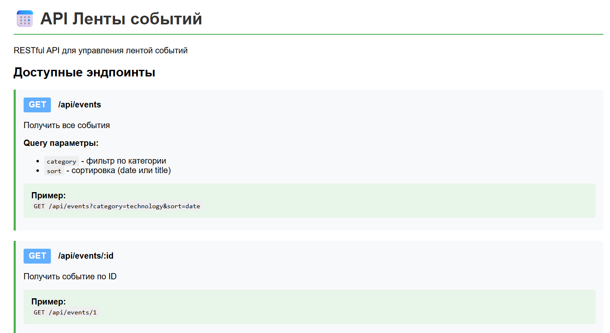
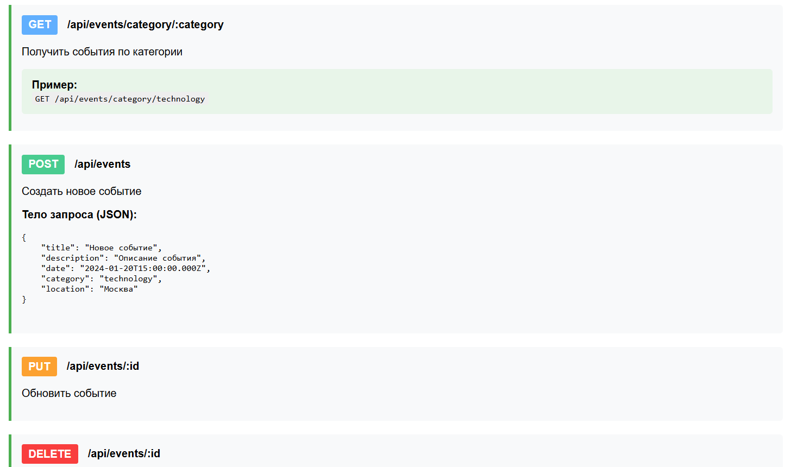
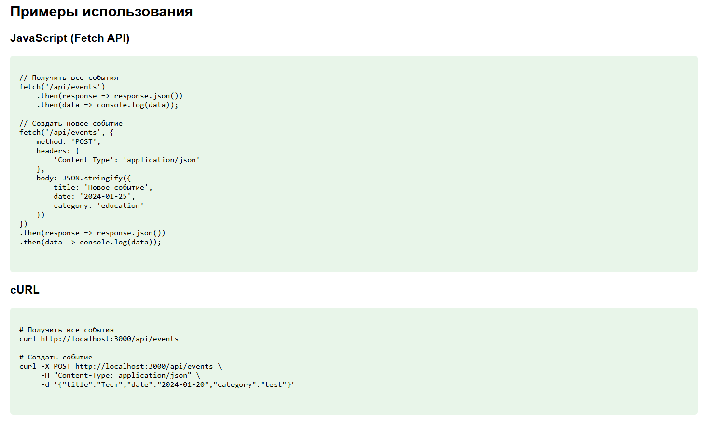

# Event Feed API

Express приложение для управления лентой событий.

## 📋 Функциональность

- CRUD операции для событий
- Фильтрация событий по категории
- Сортировка по дате или названию
- Логирование запросов
- RESTful API

## 🚀 Установка и запуск

1. Клонировать репозиторий:
```bash
git clone https://github.com/kirill944/TIP_KR5
cd event-feed-api
```

2. Установить зависимости:
```bash
npm install
```

3. Запустить сервер:
```bash
npm start
```

Описание и примеры запросов: http://localhost:3000/


